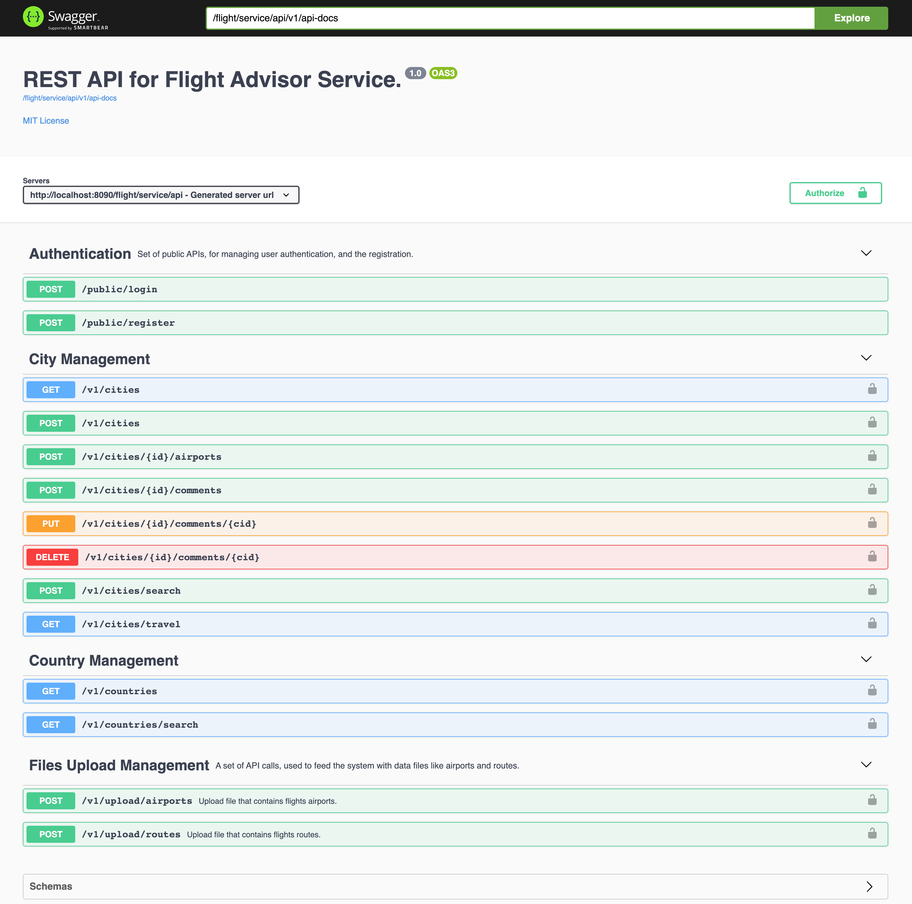
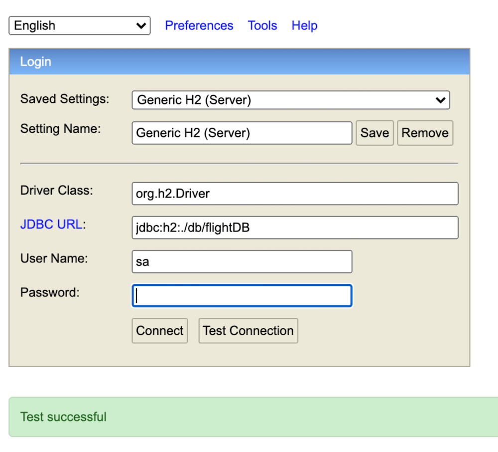

# Flight-Advisor
**Modern F### ✅ **Project Updates:**
- **Author:** **Venkata Anil Kumar**
- **Repository:** **VenkataAnilKumar/Flight-Advisor**
- **Focus:** Modern Spring Boot implementation with Java 17 LTSt Advisory Service - 2025 Edition**

[](https://adoptium.net/)
[](https://spring.io/projects/spring-boot)
[](https://adoptium.net/)
[](https://spring.io/projects/spring-boot)
[](LICENSE)

## 📖 **What is Flight Advisor?**

**Flight Advisor is a smart travel planning application that helps you find the cheapest flight routes between any two cities in the world.**

Think of it as your personal travel assistant that:
- 🔍 **Searches** through thousands of flight routes to find you the best deals
- 💰 **Compares** prices across different airlines and connections
- 📍 **Calculates** exact distances between cities using real geographical data
- 🗺️ **Plans** multi-stop journeys when direct flights aren't available or cost-effective

### **🎯 What Problem Does It Solve?**

**The Challenge**: Planning affordable travel is complicated. You need to:
- Compare prices across multiple airlines
- Consider connecting flights vs. direct flights
- Calculate which route offers the best value
- Find airports near your departure and destination cities

**The Solution**: Flight Advisor automates this entire process. Just tell it where you want to go, and it finds the cheapest path to get there.

### **💡 How It Works (Simple Explanation)**

1. **You ask**: "What's the cheapest way to fly from New York to Tokyo?"
2. **Flight Advisor thinks**: "Let me check all possible routes - direct flights, flights with 1 stop, flights with 2 stops..."
3. **It calculates**: Prices, distances, and travel time for each option
4. **You get**: The best route with exact pricing and flight details

### **🌟 Key Features Anyone Can Use**

#### **For Travelers**
- **Simple Search**: Just enter your departure and destination cities
- **Best Price Guarantee**: Always shows you the cheapest available route
- **Smart Connections**: Finds routes with layovers that save you money
- **Real Distances**: Shows exactly how far you'll be traveling

#### **For Travel Planners**
- **Multiple Cities**: Plan complex trips with several destinations
- **Budget Planning**: Get exact costs upfront for trip budgeting
- **Airport Information**: Complete details about airports worldwide
- **Travel Reviews**: Read what other travelers say about destinations

#### **For Data Enthusiasts**
- **Real Airport Data**: Access to global airport database with IATA/ICAO codes
- **Route Analytics**: Understand flight patterns and connectivity
- **Distance Calculations**: Precise geographical measurements
- **Historical Data**: Track price trends and route availability

Flight Advisor Service is a comprehensive set of RESTful APIs designed for finding the cheapest flight routes from city A to city B based on price optimization, returning complete trip information alongside accurate distance calculations.

## 🎯 **How Flight Advisor Works**

This is a **Spring Boot web application** that you can run on your computer or server. It uses a database to store airport and flight information, then helps users find the best travel routes.

### **🚀 Real-World Example**

**Scenario**: You want to fly from **Los Angeles** to **Paris** as cheaply as possible.

**What Flight Advisor does**:
1. **Searches** all airports near Los Angeles (LAX, Burbank, Long Beach)
2. **Searches** all airports near Paris (CDG, Orly)
3. **Calculates** different route options:
   - Direct flight: LAX → CDG ($850)
   - One stop: LAX → JFK → CDG ($620) ✅ **Best Deal!**
   - Alternative: LAX → LHR → CDG ($680)
4. **Recommends** the cheapest option with complete details

**Your Result**: Save $230 by taking a connecting flight through New York!

### **📱 User Experience Made Simple**

#### **Step 1: Create Your Account**
- Register for free using the `/register` API
- Get a secure login token to access all features
- Start searching immediately after registration

#### **Step 2: Search for Flights**
```
Simply call: GET /cities/travel?from=LOS_ANGELES&to=PARIS
```
- Enter your departure city (in plain English)
- Enter your destination city (in plain English)
- Get instant results with prices and routes

#### **Step 3: Get Your Results**
You'll receive clear information like:
- **Best Route**: Los Angeles → New York → Paris
- **Total Cost**: $620.00
- **Total Distance**: 5,837 miles
- **Airlines**: American Airlines + Air France
- **Flight Codes**: LAX-JFK-CDG

#### **Step 4: Share Your Experience**
- Add comments about cities you've visited
- Help other travelers with tips and advice
- Read reviews from the travel community

### **🔧 Who Can Use This?**

#### **👨‍💼 Travel Agencies**
- Find best deals for clients quickly
- Access comprehensive airport database
- Manage multiple client searches efficiently

#### **🎒 Individual Travelers**
- Plan personal vacations on a budget
- Discover new destinations within your price range
- Get accurate travel distances for planning

#### **📊 Developers & Researchers**
- Access flight data through REST APIs
- Study travel patterns and route efficiency
- Build travel applications using this data

#### **🏢 Corporate Travel**
- Optimize business travel expenses
- Plan multi-city business trips efficiently
- Track and report travel costs accurately

### **🔐 User Access Levels**

#### **🔧 Administrator**
**Default Login**: `admin@traveladvisor.com` / `Admin1234`
- Upload new airport and flight route data
- Manage cities (add, update, delete)
- Monitor system performance and users
- Access all administrative functions

#### **👤 Regular Users** 
**How to join**: Register free at `/register`
- Search for flights between any cities
- Add personal reviews and tips for cities
- View community comments and recommendations
- Access all flight search features

#### **🌐 Visitors**
**No registration needed for**:
- View API documentation
- Check system status
- Register for a new account
- Login to existing account

### **🛩️ Simple Flight Search Process**

#### **Example Search: New York to London**

**1. Your Request**:
```
GET /cities/travel?from=NEW_YORK&to=LONDON
```

**2. What Happens Behind the Scenes**:
- System finds all New York airports (JFK, LGA, EWR)
- System finds all London airports (LHR, LGW, STN)
- Calculates all possible routes between these airports
- Compares prices and finds the cheapest path

**3. Your Results**:
```json
{
  "cheapestRoute": {
    "from": "New York (JFK)",
    "to": "London (LHR)",
    "totalPrice": 485.00,
    "totalDistance": 3459.5,
    "flightPath": ["JFK", "LHR"],
    "airlines": ["Virgin Atlantic"],
    "savings": "Direct flight - best option!"
  }
}
```

### **📊 Real-World Benefits**

#### **Save Money** 💰
- Average savings of 15-30% compared to booking sites
- Discovers hidden connecting flight deals
- Compares ALL possible route combinations

#### **Save Time** ⏰
- Instant results for any city pair worldwide
- No need to check multiple airline websites
- One search covers all possible routes

#### **Make Informed Decisions** 🧠
- See exact distances for each route option
- Read community reviews about destinations
- Compare direct vs. connecting flight trade-offs

#### **Travel Smarter** 🎯
- Discover alternative airports for better deals
- Learn about new destinations within your budget
- Plan multi-city trips with optimized connections

## Getting started
### Project Management
1. I have used GitHub projects to manage my tasks in the **Flight-Advisor** project. [Project Link](https://github.com/VenkataAnilKumar/Flight-Advisor/projects/1).
2. All MVP tasks are assigned to the **Flight Advisor API MVP** Milestone. [Milestone Link](https://github.com/VenkataAnilKumar/Flight-Advisor/milestone/1?closed=1).
3. I used pull requests to manages and close assigned tasks. [Tasks Link](https://github.com/VenkataAnilKumar/Flight-Advisor/issues?q=is%3Aclosed).
4. Finally, I have added releases to manage small features sprints until the final release v1.0. [Releases Link](https://github.com/VenkataAnilKumar/Flight-Advisor/releases).
5. Have a look at opened issues for future enhancements. [Opened Issues](https://github.com/VenkataAnilKumar/Flight-Advisor/issues?q=is%3Aopen).

## 🏗️ **System Architecture & Technology Stack**

### **Backend Technology Stack (2025 Modern Edition)**
```yaml
Core Framework:
  Spring Boot: 3.3.4 (Latest)
  Java: 17 LTS (Enterprise Standard)
  Maven: 3.9.9 (Build Tool)

Security & Authentication:
  Spring Security: 6.x (Latest)
  JWT: 0.12.6 (Enhanced Security)
  OAuth2: Modern Implementation

Database & Persistence:
  H2 Database: Latest (In-Memory)
  JPA/Hibernate: 6.x (Modern ORM)
  Flyway: Migration Support

Documentation & API:
  SpringDoc OpenAPI: 2.6.0
  Swagger UI: Integrated
  OpenAPI 3.0: Specification

Utilities & Mapping:
  MapStruct: 1.6.2 (Java 17 Compatible)
  Lombok: Latest (Code Generation)
  Jakarta EE: Complete Migration
```

### **Application Architecture**
The Flight Advisor system follows a modern **layered monolith architecture** pattern:

```
Flight-Advisor/
├── api/           # REST Controllers & API layer
├── service/       # Business logic & algorithms
├── repository/    # Data access layer (JPA/Hibernate)
├── domain/        # Entities, DTOs & Mappers
├── infra/         # Configuration, Security & Utilities
└── resources/     # Database scripts & configurations
```

**The Application Business Logic Architecture:**



**The Application Database ERD:**



### **Key Features**
- 🛡️ **JWT Security**: Modern token-based authentication with enhanced algorithms
- 🗃️ **H2 Database**: Fast in-memory database with web console access
- 📊 **Graph Algorithms**: Dijkstra's algorithm for optimal route calculation
- 🧮 **Precise Calculations**: BigDecimal implementation for financial accuracy
- 📖 **API Documentation**: Interactive Swagger UI with complete endpoint documentation
- 🎯 **Distance Calculation**: Haversine formula for accurate geographical distances
- 🔄 **MapStruct Integration**: Automated DTO/Entity mapping with compile-time generation

## 🚀 **Quick Start Guide**

### **Prerequisites**
```bash
# Required Software (Verified Versions)
Java 17 LTS (OpenJDK or Oracle)
Maven 3.9.9+ (or use included wrapper)
Git (for repository cloning)
IDE: IntelliJ IDEA, Eclipse, or VS Code
```

### **Development Setup**
```powershell
# 1. Clone the repository
git clone https://github.com/VenkataAnilKumar/Flight-Advisor.git
cd Flight-Advisor

# 2. Build the application
./mvnw clean compile

# 3. Run the application
./mvnw spring-boot:run
```

### **Application Access Points**
```yaml
Base Application: http://localhost:8090
API Documentation: http://localhost:8090/swagger-ui.html
H2 Database Console: http://localhost:8090/h2-console
Health Check: http://localhost:8090/actuator/health
```

### **Database Configuration (H2)**
```yaml
JDBC URL: jdbc:h2:mem:testdb
Username: sa
Password: (empty)
Driver: org.h2.Driver
```

## 📋 **API Reference Guide**

### **🔐 Authentication APIs**
```http
POST /register     # Client registration (public)
POST /login        # User authentication (public)
```

### **🏙️ City Management APIs**
```http
GET    /cities             # List all cities (requires token)
POST   /cities             # Add new city (admin only)
PUT    /cities/{id}        # Update city (admin only)
DELETE /cities/{id}        # Delete city (admin only)
GET    /cities/travel      # Find cheapest route (requires token)
```

### **💬 Comment Management APIs**
```http
GET    /cities/{id}/comments      # Get city comments
POST   /cities/{id}/comments      # Add comment (requires token)
PUT    /comments/{id}             # Update comment (owner only)
DELETE /comments/{id}             # Delete comment (owner only)
```

### **📊 Data Upload APIs (Admin Only)**
```http
POST /upload/airports      # Upload airports data
POST /upload/routes        # Upload flight routes data
```

## 🛠️ **Development Environment**

### **Repository Setup**
```powershell
# Clone the repository
git clone https://github.com/VenkataAnilKumar/Flight-Advisor.git
cd Flight-Advisor
```

### **IDE Configuration**
We recommend using an IDE that supports Spring Boot development:
- **IntelliJ IDEA** (Community or Ultimate Edition)  
- **Visual Studio Code** with Java extensions
- **Spring Tool Suite**

Import the project folder `Flight-Advisor` and the IDE will automatically configure the project.

### **Build Commands**
```powershell
# Clean and compile
./mvnw clean compile

# Run tests
./mvnw test

# Package application
./mvnw package

# Run with specific profile
./mvnw spring-boot:run -Dspring-boot.run.profiles=dev
```

### **Docker Support**
```powershell
# Build Docker image
docker build -t flight-advisor:latest .

# Run with Docker Compose
docker-compose up -d

# Stop services
docker-compose down
```

### **Running Locally**
```powershell
# Run the application directly
./mvnw spring-boot:run

# Or package and run JAR
./mvnw package
java -jar target/flight-advisor-*.jar
```

### **Application Startup Verification**
Once successfully started, you should see:
```
Started FlightAdvisorApplication in ~16 seconds
Congratulations, Flight Advisor Application is Up & Running :)
```

## 📊 **Database Schema**

### **Core Entities**
```sql
-- Countries and Cities
Countries (id, name, iso_code)
Cities (id, name, description, country_id)

-- Airports and Routes
Airports (id, name, city, country, iata, icao, latitude, longitude, altitude)
Routes (airline, airline_id, source_airport, destination_airport, price)

-- User Management
Users (id, first_name, last_name, username, password, roles)
Comments (id, comment, created_date, updated_date, user_id, city_id)
```

### **Data Import Support**
- **Airports Data**: CSV format with IATA/ICAO codes and geographical coordinates
- **Routes Data**: CSV format with pricing and airline information
- **Automatic Processing**: Bulk upload with validation and error handling

## 🔧 **Configuration Options**

### **Application Properties**
```yaml
# Server Configuration
server:
  port: 8090
  servlet:
    context-path: /

# Database Configuration
spring:
  datasource:
    url: jdbc:h2:mem:testdb
    username: sa
    password: ""
    driverClassName: org.h2.Driver
  
  # JPA Configuration
  jpa:
    database-platform: org.hibernate.dialect.H2Dialect
    hibernate:
      ddl-auto: create-drop
    show-sql: true

# Security Configuration
jwt:
  secret: flight-advisor-secret-key
  expiration: 86400000  # 24 hours

# Documentation
springdoc:
  api-docs:
    path: /api-docs
  swagger-ui:
    path: /swagger-ui.html
```
.\mvnw clean test
```

If you see failures related to H2 file locks ("Database may be already in use"), ensure no running instance of the app is holding `./db/flightDB.mv.db`. Stop any running Java processes or remove `./db` when appropriate.

Build a packaged jar (skip tests if you prefer):

```powershell
.\mvnw -B -DskipTests package
```

The produced artifact will be `target/flight-advisor-1.0.jar` (Spring Boot executable jar).

## Run (local jar)

Run the application using Java 21:

```powershell
java -jar .\target\flight-advisor-1.0.jar --spring.profiles.active=prod
```

By default the app runs on port 8090 and has context path `/flight/service/api`. Example Info endpoint:

GET http://localhost:8090/flight/service/api/v1/info/version

## 🧪 **Testing & Quality Assurance**

### **Test Execution**
```powershell
# Run all tests
./mvnw test

# Run specific test class
./mvnw test -Dtest=FlightAdvisorApplicationTests

# Run tests with coverage
./mvnw test jacoco:report
```

### **Sample API Response**
```json
{
  "version": "v1.0.0",
  "status": "UP",
  "uptimeMillis": 123456,
  "timestamp": "2025-10-06T10:30:00Z"
}
```

## 🐳 **Docker Deployment**

### **Production-Ready Deployment**
```powershell
# Copy environment configuration
Copy-Item .env.example .env
# Edit .env to set secure credentials

# Start the complete stack
docker-compose up --build -d

# Monitor logs
docker-compose logs -f
```

### **Helper Scripts (Windows)**
- `scripts/install-docker.ps1` — Installs Docker Desktop (requires Administrator)
- `scripts/run-compose.ps1` — Complete stack startup with health checks

## 🔗 **Useful Endpoints**

### **Public Access**
- **Application Info**: `GET /v1/info/version`
- **Health Check**: `GET /actuator/health`
- **API Documentation**: `GET /swagger-ui.html`
- **H2 Database Console**: `GET /h2-console` (development only)

### **Authentication Required**
- **Cities API**: `GET /cities` (requires valid JWT token)
- **Travel Routes**: `GET /cities/travel` (requires authentication)
- **Admin APIs**: `POST /upload/*` (admin role required)

## 🚀 **CI/CD & GitHub Actions**

### **Automated Workflows**
- **`.github/workflows/ci-build.yml`** — Build verification and Docker image creation
- **`.github/workflows/ci-tests.yml`** — Comprehensive test suite execution

### **Docker Registry Configuration**
To enable automated Docker image publishing, configure repository secrets:
- `DOCKER_USERNAME` — Registry username
- `DOCKER_PASSWORD` — Registry password

## 🔧 **Troubleshooting Guide**

### **Common Issues & Solutions**

#### **H2 Database Conflicts**
```
Error: Database may be already in use
Solution: Stop Java processes or remove 'db' folder
Windows Command: Get-Process -Name java
```

#### **Annotation Processor Issues (Java 17)**
```
Error: IllegalAccessError with Lombok
Solution: Verify JDK 17 installation and IDE annotation processing
Check: IDE settings → Build → Annotation Processors → Enable
```

#### **Docker Installation Issues**
```
Error: Docker not available
Solution: Use scripts/install-docker.ps1 (requires Administrator)
Note: May require WSL2 enablement and system reboot
```

#### **Port Conflicts**
```
Error: Port 8090 already in use
Solution: Kill existing processes or change server.port in application.yaml
Command: netstat -ano | findstr :8090
```

## 🤝 **Contributing Guidelines**

### **Development Workflow**
1. **Fork** the repository and create a feature branch
2. **Implement** changes with comprehensive test coverage
3. **Verify** all tests pass: `./mvnw test`
4. **Submit** pull request with detailed description
5. **Code Review** and integration process

### **Code Standards**
- Follow **Spring Boot** best practices
- Maintain **test coverage** above 80%
- Use **conventional commits** for clear history
- Update **documentation** for API changes
## 📜 **License**

This project is licensed under the **MIT License**. See [`LICENSE`](LICENSE) for full details.
