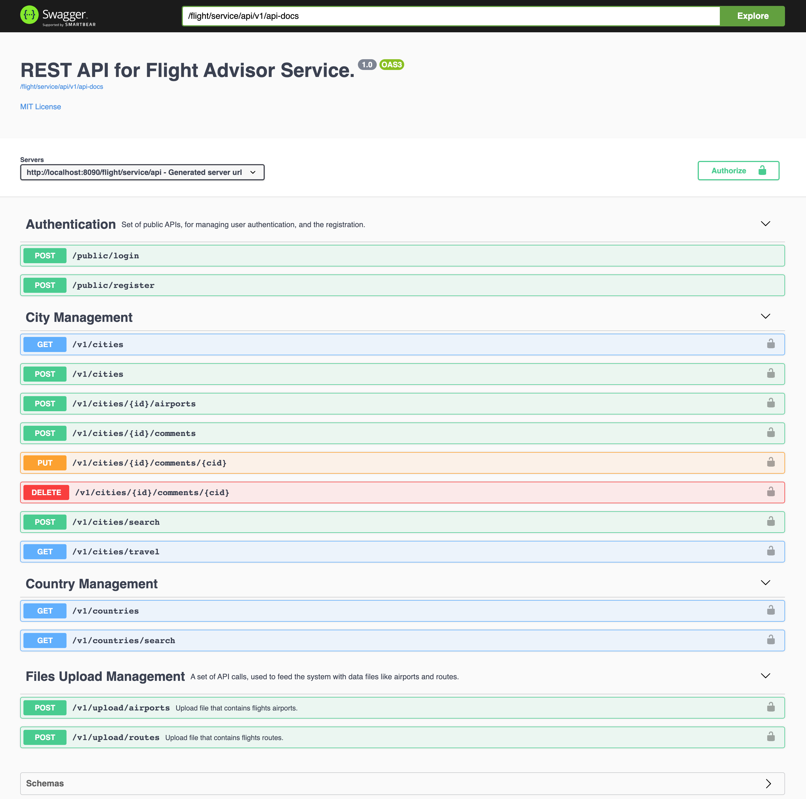

# Flight-Advisor
Flight Advisor

Flight advisor Service is a set of APIs for primarily finding the cheapest flight from city A to city B based on price, returning all the trip information alongside the distance.

## System Functionality
- This project is developing a layered monolith **Spring Boot** based project (Latest version 2.4.0), with an in-memory database.
- This project is an OAuth2 based project, using JWT token to secure endpoints. So you need to register first to continue using the system.
- The functionality is reached based on user role, and there are three roles in the system.
    - **Admin**: user is a predefined user (*admin@traveladvisor.com/Admin1234*). 
        - Admin needs to login first through `/login` API to get their token to contact the system.
        - This user can upload airports and flight routes.
        - Admin manages cities by adding, updating, or deleting them.
        - Actually, the admin can do anything in the system.
    -  **Client**: Clients should register first before using the system through `/register` public API. 
        -  After successful registration, they can then use the public `/login` API to get a token to contact the system successfully.
        - Client can use all read API calls.
        - Clients can add, manage their comments for a city, add, update, delete their comments, and see other comments.
        - User can get the cheapest flight by calling `/cities/travel` API and provide airport codes for [from the city] and [to the city].
    -  **Public**: it is not a role, but anonymous users use APIs under public.
        - Use `/login` API to login to the system, with username and password. Then you will get a valid token.
        - Use `/register` API to register as a client to use the system functionality.

## Getting started
### Project Management
1. I have used GitHub projects to manage my tasks in the **Flight-Advisor** project. [Project Link](https://github.com/VenkataAnilKumar/Flight-Advisor/projects/1).
2. All MVP tasks are assigned to the **Flight Advisor API MVP** Milestone. [Milestone Link](https://github.com/VenkataAnilKumar/Flight-Advisor/milestone/1?closed=1).
3. I used pull requests to manages and close assigned tasks. [Tasks Link](https://github.com/VenkataAnilKumar/Flight-Advisor/issues?q=is%3Aclosed).
4. Finally, I have added releases to manage small features sprints until the final release v1.0. [Releases Link](https://github.com/VenkataAnilKumar/Flight-Advisor/releases).
5. Have a look at opened issues for future enhancements. [Opened Issues](https://github.com/VenkataAnilKumar/Flight-Advisor/issues?q=is%3Aopen).

### System components Structure
Let's explain first the system layers structure to understand its components:
```
Flight-Advisor --> Parent folder. 
|- docs --> Contains system images.
|- data --> Contains Airports and routes files. 
|- src/main/java - org.siriusxi.htec.fa (package) 
  |- FlightAdvisorApplication.java --> The main starting point of the application.
  |- api --> Contains All REST API controllers that receive requests from the client,
             to process that request, and finally, return appropriate responses.
  |- repository --> All the database entities CRUD management services. 
  |- domain --> Domain contains all the database modeled entities, 
                all request and response DTOs, as well as the mappers.
  |- infra --> Contains all the configurations, exceptions, security management, 
               and support utilities to the system. 
  |- service --> Contains all the system business login, 
                 receives calls from Controllers, call repository to retrieve and manage data, 
                 then process them to return them to Controllers. 
```
Now, as we have learned about different system layers, then let's start.

## Playing With Flight Advisor Project
First things first, download the following pics of software to have fun with the project:
### Required software

The following are the initially required software pieces:
1. **Maven**: it can be downloaded from https://maven.apache.org/download.cgi#.
2. **Git**: it can be downloaded from https://git-scm.com/downloads.
3. **Java 15.0.1**: it can be downloaded from https://jdk.java.net/15/.

Follow the installation guide for each software website link and check your software versions from the command line to verify that they are all installed correctly.

### Cloning It

Now it is the time to open **terminal** or **git bash** command line, and then clone the project under any of your favorite places with the following command:

```bash
> git clone https://github.com/VenkataAnilKumar/Flight-Advisor.git
```
### Using an IDE
I recommend that you work with your Java code using an IDE that supports the development of Spring Boot applications such as **Spring Tool Suite** or **IntelliJ IDEA Community | Ultimate Edition**. 

All you have to do is fire up your favorite IDE **->** open or import the parent folder `Flight-Advisor,` and everything will be ready for you.

### Building & Running The System
To build and run the system, run the following command:

```bash
?? [mtaman]:Flight-Advisor ~~ ./mvnw clean package
```
Now you should expect output like this:
```JavaScript
[INFO] Tests run: 1, Failures: 0, Errors: 0, Skipped: 0
[INFO] 
[INFO] 
[INFO] --- maven-jar-plugin:3.2.0:jar (default-jar) @ flight-advisor ---
[INFO] Building jar: /Flight-Advisor/target/flight-advisor-1.0.jar
[INFO] 
[INFO] --- spring-boot-maven-plugin:2.4.0:repackage (repackage) @ flight-advisor ---
[INFO] Replacing main artifact with repackaged archive
[INFO] ------------------------------------------------------------------------
[INFO] BUILD SUCCESS
[INFO] ------------------------------------------------------------------------
[INFO] Total time:  14.620 s
[INFO] Finished at: 2023-11-15T13:40:50+01:00
[INFO] -----------------------------------------------------------------------
```
#### Running the System
Now it's the time to run the system, and it's straightforward, just hit the following commands:

```bash
?? [mtaman]:Flight-Advisor ~~ java --enable-preview -jar ./target/*.jar \ 
?? [mtaman]:Flight-Advisor ~+ --spring.profiles.active=prod
```
Or
```bash
 ?? [mtaman]:Flight-Advisor ~~ ./mvnw spring-boot:run \
 ?? [mtaman]:Flight-Advisor ~+ -Dspring-boot.run.jvmArguments="--enable-preview" \
 ?? [mtaman]:Flight-Advisor ~+ -Dspring-boot.run.arguments="--spring.profiles.active=prod"
```
**Flight Advisor System** will run, with embedded H2 **database** that will be created under `db` folder and then the `flightDB.mv.db` file, and you should expect an output like this:

```javascript
2023-11-15 13:56:16.587  INFO 2981 --- [  restartedMain] o.s.b.a.h2.H2ConsoleAutoConfiguration: 
H2 console available at '/db-console'. 
Database available at 'jdbc:h2:./db/flightDB'

2023-11-15 13:56:18.081  INFO 2981 --- [  restartedMain] o.s.b.w.embedded.tomcat.TomcatWebServer: 
Tomcat started on port(s): 8090 (http) with 
context path '/flight/service/api'

2023-11-15 13:56:18.581  INFO 2981 --- [  restartedMain] o.s.h.f.F.AppStartupRunner: 
Congratulations, Flight Advisor Application, is Up & Running :)
```
### Access Flight Advisor System APIs
You can play and test `Flight Advisor` APIs throughout its **OpenAPI** interface. 
1. Go to the landing page at the following URL [http://localhost:8090/flight/service/api/](http://localhost:8090/flight/service/api/).
2. follow the link on the page, and you should see the following:


